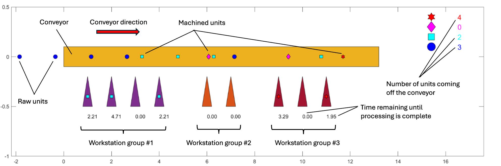

# Flexible Conveyor Belt Simulation Tool (MATLAB)

## 📖 About The Project

The **conveyor_sim** project is intended for the visualization and validation of the efficiency of a linear conveyor belt with different workstations. Units are processed sequentially according to the technological process at each workstation. Before setting up a production line, engineers must ensure that the number of robots at the workstations can handle the conveyor's speed **V** and the frequency **1/P** at which units are placed on it.

**Core Simulation Scenarios:**
The tool provides a flexible environment to test different production hypotheses:
* **Fixed Speed & Feed Rate:** Use the Excel configuration file to determine the optimal number of workstations required in each group to handle the incoming load.
* **Fixed Workstations & Feed Rate:** Adjust the conveyor speed to match your existing hardware constraints.

This flexibility enables engineers to iteratively model and fine-tune the assembly line parameters to minimize or completely eliminate the number of unprocessed (scrap) parts.

### ✨ Key Features

* 🔌 **Data-Driven Configuration:** Easy configuration of robot groups and operation times via `.xlsx` files.
* ⚙️ **Finite State Machine (FSM) Logic:** Each workstation follows a strict state-transition model. A missed operation (bottleneck) triggers an immediate transition to the "Scrap" state, preventing invalid downstream processing.
* 📊 **Dynamic Bottleneck Visualization:** Real-time animated feedback using MATLAB's plotting engine to identify where and why parts are being rejected.
* 🛠 **Hypothesis Validation:** A flexible environment to verify production line optimizations before physical implementation.
* ⏱️ **Dynamic Simulation Duration:** No more hardcoded time loops. Define the exact number of parts (MAX_UNITS), and the engine automatically calculates the required simulation time. Test anything from a single unit up to thousands!
* 🚀 **Optimized Performance:** Built-in frame skipping (RENDER_EVERY) ensures smooth animations without freezing MATLAB's plotting engine, even during heavy simulations.

🎥 **[Watch the full 30-unit simulation on YouTube ↗](https://www.youtube.com/watch?v=KF4AeIblpEo)** *(opens in a new tab)*

## 🔍 Overview

---

## 🎨 Understanding the Animation

To make it easy to track the production flow and identify bottlenecks, the simulation uses shape and color coding. As a unit passes through different workstation groups, its marker evolves:

*  **Raw Unit** (Blue Circle) — *Just placed on the conveyor*
*  **Stage 1 Done** (Cyan Square) — *Processed by Group 1*
*  **Stage 2 Done** (Magenta Diamond) — *Processed by Group 2*
*  **Stage 3 Done** (Red Hexagon) — *Processed by Group 3* → **Finished Product**

**How to spot a failure:** At the end of the conveyor, you should ideally only see **Red Hexagon**. If the sequence is broken (e.g., a unit skips Group 1 due to a bottleneck), downstream robots will ignore it. If a Cyan Square or Magenta Diamond falls off the end of the belt, that unit is officially **Scrap**, and the marker's shape tells you exactly which workstation group failed to process it!

---
## 📋 Description of the most important parts of the simulated conveyor system

The linear conveyor is described by the following parameters:
- **dt** - Simulation time step, s
- **V** - Conveyor speed, m/s
- **L** - Conveyor length, m
- **S** - Minimum safety distance between units, m
- **W** - Length of unit side, m 
- **Z** - Work zone radius for each station on the conveyor, m
- **P** - Unit placement time (period) on moving conveyor, s
- **D** - Distance between unit centres, m

Each workstation is described in the xlsx-file table and has the following parameters:
- **Position** - Position along the length of the conveyor, m
- **Picking** - Time for picking of unit from conveyor to the workstation, s
- **Working** - Unit processing time at the workstation, s
- **Placing** - Time for place the unit from the workstation to the conveyor, s
- **Type** - Workstation group number

The next two columns are service fields and do not need to be filled in (they may be used in the future to simulate a non-zero initial state of the conveyor):
- **Busy** - Logical flag to indicate if the workstation is busy, bool
- **Process** - Time required to complete the processing of a unit at the workstation, s

An example of filling out the rows of the _stations.xlsx_ table located in the `/data` folder:

| Position | Picking | Working | Placing | Busy | Process | Type |
| -------- | ------- | ------- | ------- | ---- | ------- | ---- |
|    0.7   |    6    |   67    |    8    |   0  |     0   |   1  |
|    1.54  |    6    |   67    |    8    |   0  |     0   |   1  |
|    2.37  |    7    |   52    |    5    |   0  |     0   |   2  |

You can add a maximum of 6 types of workstations to the table. The number of workstations in each group is almost unlimited.

---

## 🚀 Usage

1. Open MATLAB and navigate to the project folder.
2. In order for the m-script to work correctly, you must first activate the environment by double-clicking the `Conveyor_sim.prj` file.
3. Once all the necessary parameters have been entered into the `stations.xlsx` table, start the simulation process by running the `conveyor_sim.m` script.